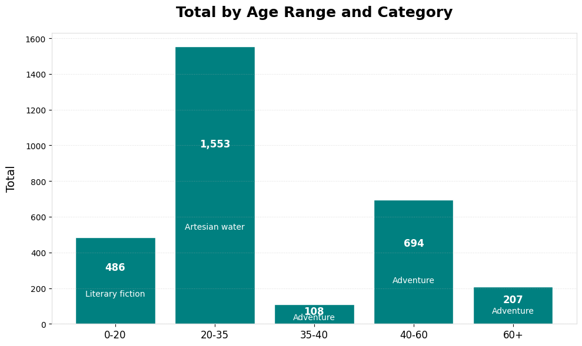

# Pendahuluan

Projek atau portofolio ini bertujuan untuk mengeksplorasi dataset sebuah toko retail menggunakan bahasa SQL
selain itu juga proyek ini bertujuan untuk mendemonstrasikan kemampuan SQL

## Keterangan

Dataset sudah melalui preprocessing dan data cleaning menggunakan Python agar lebih mudah
dan ada beberapa query SQL disini untuk mengecek missing values pada dataset

# Business Problems + Analytical findings

1. What is the product category with the most purchases?
2. How is the customer feedback for the products based on the average rating?
3. Which city has the most order purchases?
4. What is the total number of orders by month (time series)?
5. How is customer segmentation determined by age?
6. Which age group and product have the highest total orders?
7. Which product generates the most revenue based on age segmentation?
8. Compare the revenue between 2023 and 2024.
9. Count the customer feedback by segmenting it into Excellent, Good, Average, and Bad categories!

## In Indonesia:

1. Kategori produk apa yang memiliki jumlah pembelian terbanyak?
2. Bagaimana umpan balik pelanggan terhadap produk berdasarkan rata-rata rating?
3. Kota mana yang memiliki jumlah pembelian pesanan terbanyak?
4. Berapa total jumlah pesanan per bulan (time series)?
5. Bagaimana segmentasi pelanggan berdasarkan usia?
6. Segmen usia dan produk mana yang memiliki total pesanan terbanyak?
7. Produk apa yang menghasilkan pendapatan terbanyak berdasarkan segmentasi usia?
8. Bandingkan pendapatan tahun 2023 dan 2024.
9. Hitung umpan balik pelanggan dengan mengelompokkannya menjadi kategori Excellent, Good, Average, dan Bad!

# Loading Data

```sql
LOAD DATA LOCAL INFILE 'D:\\Dummy-Data\\Retail Analysis on Large Dataset\\retail_data_clean.csv'
INTO TABLE new_retail_data
FIELDS TERMINATED BY ','
IGNORE 1 ROWS;
```

### Query

# Checking NULL and blank values for columns that indicates missing values (checked by Python)

```sql
SELECT COUNT(*)
FROM new_retail_data
WHERE customer_id IS NULL;

SELECT COUNT(*)
FROM new_retail_data
WHERE customer_segment = '';

SELECT COUNT(*)
FROM new_retail_data
WHERE customer_id = '';
```

# Analysis

1. Kategori produk apa yang memiliki jumlah pembelian terbanyak?

```sql
-- Product Category with most purchases
SELECT SUM(Total_Purchases) AS Total_Purchases, product_category
FROM new_retail_data
GROUP BY Product_Category
ORDER BY Total_Purchases DESC
LIMIT 5;
```


2. Bagaimana umpan balik pelanggan terhadap produk berdasarkan rata-rata rating?

```sql
-- Average rate products (for product development, customer feedback)
SELECT avg(ratings) as Average_Rate, products
FROM new_retail_data
GROUP BY products
ORDER BY Average_Rate DESC
LIMIT 5;
```


3. Kota mana yang memiliki jumlah pembelian pesanan terbanyak?

```sql
-- most order by city (to see more segmented and optimized total order)
SELECT COUNT(City) AS Total_order_city, City
FROM new_retail_data
GROUP BY City
ORDER BY Total_order_city DESC
LIMIT 5;
```


4. Berapa total jumlah pesanan per bulan (time series)?

```sql
-- Total order by month (finding peak season by month)
SELECT `Month`, COUNT(`Month`) AS Total_order_month
FROM new_retail_data
GROUP BY `Month`
ORDER BY
  CASE TRIM(`Month`)
    WHEN 'January' THEN 1
    WHEN 'February' THEN 2
    WHEN 'March' THEN 3
    WHEN 'April' THEN 4
    WHEN 'May' THEN 5
    WHEN 'June' THEN 6
    WHEN 'July' THEN 7
    WHEN 'August' THEN 8
    WHEN 'September' THEN 9
    WHEN 'October' THEN 10
    WHEN 'November' THEN 11
    WHEN 'December' THEN 12
  END;
```

 5. Bagaimana segmentasi pelanggan berdasarkan usia?

```sql
-- Customer segmentation by age
SELECT
  CASE
    WHEN Age BETWEEN 0 AND 20 THEN '0-20'
    WHEN Age BETWEEN 20 AND 35 THEN '20-35'
    WHEN Age BETWEEN 35 AND 40 THEN '35-40'
    WHEN Age BETWEEN 40 AND 60 THEN '40-60'
    ELSE '60+'
  END AS `Age Range`,
  COUNT(*) AS Total_order_Age
FROM new_retail_data
GROUP BY `Age Range`
ORDER BY `Age Range`;
```

 6. Segmen usia dan produk mana yang memiliki total pesanan terbanyak?

```sql
-- Most total orders based on age segmentation and products
SELECT Age_Group, products, Total_Orders
FROM (
  SELECT
    CASE
      WHEN Age BETWEEN 0 AND 20 THEN '0-20'
      WHEN Age > 20 AND Age <= 35 THEN '20-35'
      WHEN Age > 35 AND Age <= 40 THEN '35-40'
      WHEN Age > 40 AND Age <= 60 THEN '40-60'
      ELSE '60+'
    END AS Age_Group,
    products,
    COUNT(*) AS Total_Orders,
    ROW_NUMBER() OVER (PARTITION BY
      CASE
        WHEN Age BETWEEN 0 AND 20 THEN '0-20'
        WHEN Age > 20 AND Age <= 35 THEN '20-35'
        WHEN Age > 35 AND Age <= 40 THEN '35-40'
        WHEN Age > 40 AND Age <= 60 THEN '40-60'
        ELSE '60+'
      END ORDER BY COUNT(*) DESC) AS rn
  FROM new_retail_data
  GROUP BY Age_Group, products
) AS ranked
-- rn = 2 because this is more measured (terhitung)
WHERE rn = 2;
```

 7. Produk apa yang menghasilkan pendapatan terbanyak berdasarkan segmentasi usia?

```sql
-- product with most revenue generated based by age segmentation
SELECT Age_Group, products, Total_Revenue
FROM (
  SELECT
    CASE
      WHEN Age BETWEEN 0 AND 20 THEN '0-20'
      WHEN Age > 20 AND Age <= 35 THEN '20-35'
      WHEN Age > 35 AND Age <= 40 THEN '35-40'
      WHEN Age > 40 AND Age <= 60 THEN '40-60'
      ELSE '60+'
    END AS Age_Group,
    products,
    SUM(Total_Amount) AS Total_Revenue,
    ROW_NUMBER() OVER (
      PARTITION BY
        CASE
          WHEN Age BETWEEN 0 AND 20 THEN '0-20'
          WHEN Age > 20 AND Age <= 35 THEN '20-35'
          WHEN Age > 35 AND Age <= 40 THEN '35-40'
          WHEN Age > 40 AND Age <= 60 THEN '40-60'
          ELSE '60+'
        END
      ORDER BY SUM(Total_Amount) DESC
    ) AS rn
  FROM new_retail_data
  GROUP BY
    CASE
      WHEN Age BETWEEN 0 AND 20 THEN '0-20'
      WHEN Age > 20 AND Age <= 35 THEN '20-35'
      WHEN Age > 35 AND Age <= 40 THEN '35-40'
      WHEN Age > 40 AND Age <= 60 THEN '40-60'
      ELSE '60+'
    END,
    products
) AS ranked
-- rn = 3 because this is more measured (terhitung)
WHERE rn = 3;
```


8. Bandingkan pendapatan tahun 2023 dan 2024.

```sql
SELECT Year, SUM(Total_Amount) as "Revenue"
FROM new_retail_data
GROUP BY Year;
```


9. Hitung umpan balik pelanggan dengan mengelompokkannya menjadi kategori Excellent, Good, Average, dan Bad!

```sql
SELECT Feedback, Count(Feedback) AS Total
FROM new_retail_data
GROUP BY Feedback
ORDER BY Total DESC;
```


